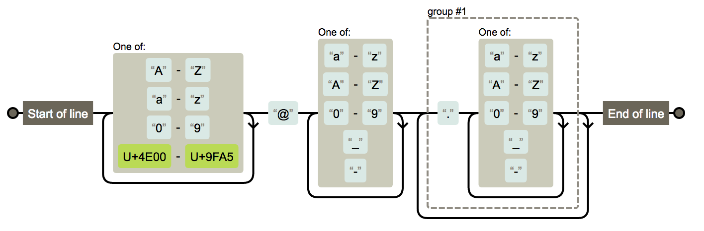
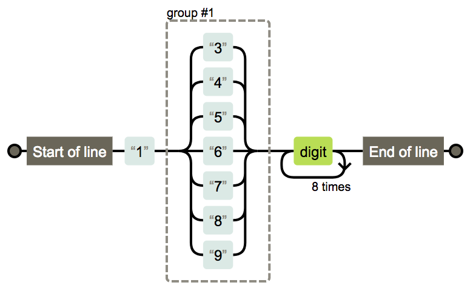
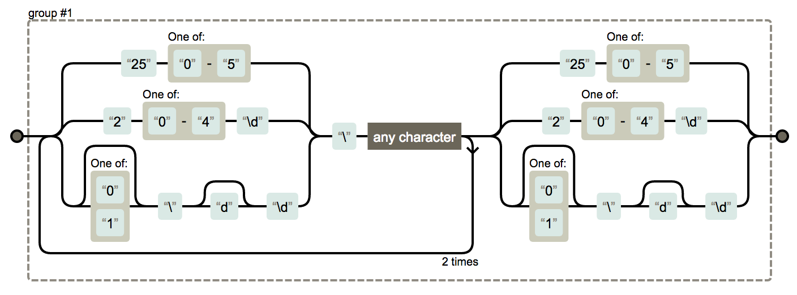
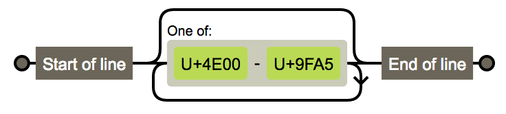
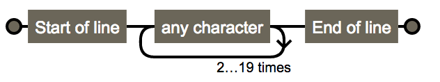
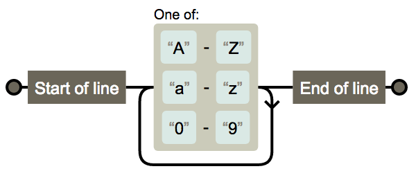
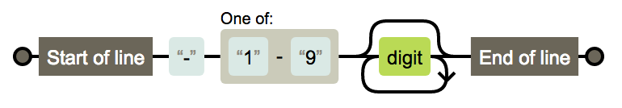
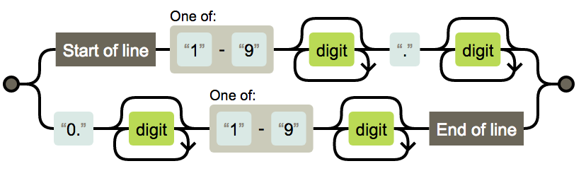
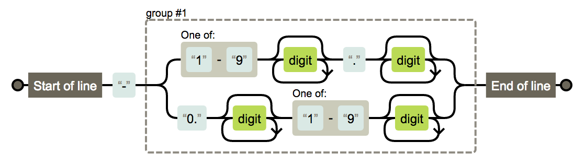
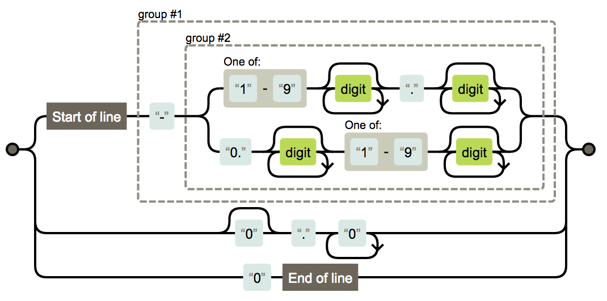

# 内容信息提取
> 主要用户提取 文本内容

## 内置方法
- [vela.extract.jq(string...)](#json) &emsp; 提取json中的内容
- [vela.extract.regex(string...)](#regex) &emsp; 利用regex提取内容 
- [vela.extract.xpath(string...)](#xpath) &emsp; 利用xpath提取内容 

## 内置对象
- [vela.extract.ipv4](#regex) &emsp; 通过正则获取IPv4地址
- [vela.extract.url](#regex) &emsp; 通过正则获取url地址
- [vela.extract.number](#regex) &emsp; 通过正则获取数字地址
- [vela.extract.phone](#regex) &emsp; 通过正则获取手机号地址

```lua
    local box = vela.extract.ipv4("a192.168.1.2bbc192.168.10.1")
    box.pipe(print)

    local box = vela.extract.url("a192.168.1.2bbc192.168.10.1")
    box.pipe(print)

    local box = vela.extract.number("a192.168.1.2bbc192.168.10.1")
    box.pipe(print)

    local box = vela.extract.phone("a192.168.1.2bbc192.168.10.1")
    box.pipe(print)
```


## json
> jq = vela.extract.jq([string](#)) &emsp;满足jq的的语法提取规则 <br />
> 返回Json的query对象

- json内置方法:
- [box](#box)=jq(body) &emsp;直接返回结
- [box](#box)=jq.file(filepath) &emsp; 直接从文件中提取内容
- [box](#box)=jq.request(url) &emsp; 下载页面 

```lua
    local jq = vela.extract.jq(".name.age")
    jq([[{"name":"{"name":"Mr.wang"}"}]]).pipe(function(v ,id)
        print(v , id)
    end)
```


## regex
> regex = vela.extract.regex([string](#)) &emsp;返回正则表达式字段
> 参考[正则大全](#正则大全)

- regex内置方法:
- [regex.debug(body)](#) &emsp;调试正则的数据 会产生debug的event事件
- [regex](#regex) = regex.part(int) &emsp;提取产生的后的sub string的第几个字符 , 默认全部 子字符串并拼接 ;返回自己自身对象
- [box](#box) = regex(body) &emsp; 从目标提取
- [box](#box) = regex.file(filepath) &emsp;从文件中提取
- [box](#box) = regex.request(url) &emsp;请求并提取中提取

```lua
    -- 定义正则解析器
    local re = vela.extract.regex[[(root.\((www.[a-z]+.com)\).([a-z]+))]].part(4) -- 提取第4个子串

    -- 查看正则匹配信息
    re.debug[[root.(www.baidu.com).app\nroot.(www.google.com).cn]]

    -- 匹配并答应
    re[[root.(www.baidu.com).app\nroot.(www.google.com).cn]].pipe(function(id , v)
      print(id , v)
    end)

    -- 利用这个正则表达式 查看文件内部信息
    re.file("1.txt").pipe(print)

    -- 利用这个正则表达式 查看网页信息
    re.request("https://www.ab.com/a.html").pipe(print)
```

## xpath
> query = vela.extract.xpath(xpath) <br />
> 返回xpath查询器

- query内置方法
- [query](#regex) = query.attar(string) &emsp;提取元素的属性 没有就是innerText
- [box](#box) = query(body) &emsp;从对象中提取
- [box](#box) = query.file(filepath) &emsp;从文件中提取
- [box](#box) = query.request(url) &emsp;请求并提取中提取

```lua
    local xml = [[<?xml version="1.0" encoding="UTF-8" ?>
    <rss version="2.0">
    <channel>
      <title>W3Schools Home Page</title>
      <link>https://www.w3schools.com</link>
      <description>Free web building tutorials</description>
      <item>
        <title>RSS Tutorial</title>
        <link>https://www.w3schools.com/xml/xml_rss.asp</link>
        <description>New RSS tutorial on W3Schools</description>
      </item>
      <item>
        <title>XML Tutorial</title>
        <link>https://www.w3schools.com/xml</link>
        <description>New XML tutorial on W3Schools</description>
      </item>
    </channel>
    </rss>
    ]]

    local xpath = vela.extract.xpath("//item/link")
    xpath(xml).pipe(function(v , id)
        print(v , id)
    end)

    local xpath = vela.extract.xpath("//item/link").attar("value")
    xpath(xml).pipe(function(v , id)
        print(v , id)
    end)

```

## box
> 提取内容后保存 结果的对象 支持pipe方法遍历 或者直接执行 如下

```lua
    -- 是否报错
    print(box.err)

    -- 利用pipe调用
    local box = vela.extract.ipv4("a192.168.1.1b192.168.1.3")
    box.pipe(function(v , id)
        print(v , id)
    end)
    -- 直接调用
    local box = vela.extract.ipv4("a192.168.1.1b192.168.1.3")
    box(function(v , id)
        print(v , id)
    end)
```

## 正则大全

- [邮箱](#邮箱)
- [电话](#电话)
- [域名](#域名)
- [IP](#ip)
- [帐号校验](#帐号校验)
- [字符校验](#字符校验)
    - [汉字](#汉字)
    - [英文和数字](#英文和数字)
    - [长度为3-20的所有字符](#长度为3-20的所有字符)
    - [英文字符](#由英文字符)
        - [由26个英文字母组成的字符串](#由26个英文字母组成的字符串)
        - [由26个大写英文字母组成的字符串](#由26个大写英文字母组成的字符串)
        - [由26个小写英文字母组成的字符串](#由26个小写英文字母组成的字符串)
        - [由数字和26个英文字母组成的字符串](#由数字和26个英文字母组成的字符串)
        - [由数字、26个英文字母或者下划线组成的字符串](#由数字26个英文字母或者下划线组成的字符串)
    - [中文、英文、数字包括下划线](#中文英文数字包括下划线)
    - [中文、英文、数字但不包括下划线等符号](#中文英文数字但不包括下划线等符号)
    - [禁止输入含有^%&',;=?$\"等字符](#禁止输入含有等字符)
    - [禁止输入含有~的字符](#禁止输入含有的字符)
- [数字正则](#数字正则)
    - [整数](#整数)
        - [正整数](#正整数)
        - [负整数](#负整数)
        - [非负整数](#非负整数)
        - [非正整数](#非正整数)
    - [浮点数](#浮点数)
        - [正浮点数](#正浮点数)
        - [负浮点数](#负浮点数)
        - [非负浮点数](#非负浮点数)
        - [非正浮点数](#非正浮点数)

## 邮箱

`gaozihang-001@gmail.com` 只允许英文字母、数字、下划线、英文句号、以及中划线组成

```regex
^[a-zA-Z0-9_-]+@[a-zA-Z0-9_-]+(\.[a-zA-Z0-9_-]+)+$
```


`高子航001Abc@bowbee.com.cn` 名称允许汉字、字母、数字，域名只允许英文域名

```regex
^[A-Za-z0-9\u4e00-\u9fa5]+@[a-zA-Z0-9_-]+(\.[a-zA-Z0-9_-]+)+$
```



## 电话

`13012345678` 手机号

```regex
^1(3|4|5|6|7|8|9)\d{9}$
```



`XXX-XXXXXXX` `XXXX-XXXXXXXX` 固定电话

```regex
(\(\d{3,4}\)|\d{3,4}-|\s)?\d{8}
```


## 域名

`https://google.com/`

```regex
^((http:\/\/)|(https:\/\/))?([a-zA-Z0-9]([a-zA-Z0-9\-]{0,61}[a-zA-Z0-9])?\.)+[a-zA-Z]{2,6}(\/)
```


## IP

`127.0.0.1`

```regex
((?:(?:25[0-5]|2[0-4]\d|[01]?\d?\d)\.){3}(?:25[0-5]|2[0-4]\d|[01]?\d?\d))
```



## 帐号校验

`gaozihang_001` 字母开头，允许5-16字节，允许字母数字下划线

```regex
^[a-zA-Z][a-zA-Z0-9_]{4,15}$
```


## 字符校验

### 汉字

`高子航`

```regex
^[\u4e00-\u9fa5]{0,}$
```



### 英文和数字

```regex
^[A-Za-z0-9]+$
```


### 长度为3-20的所有字符

```regex
^.{3,20}$
```



### 英文字符

#### 由26个英文字母组成的字符串

```regex
^[A-Za-z]+$
```


#### 由26个大写英文字母组成的字符串

```regex
^[A-Z]+$
```


#### 由26个小写英文字母组成的字符串

```regex
^[a-z]+$
```


#### 由数字和26个英文字母组成的字符串

```regex
^[A-Za-z0-9]+$
```



#### 由数字、26个英文字母或者下划线组成的字符串

```regex
^\w+$
```


### 中文、英文、数字包括下划线

```regex
^[\u4E00-\u9FA5A-Za-z0-9_]+$
```


### 中文、英文、数字但不包括下划线等符号

```regex
^[\u4E00-\u9FA5A-Za-z0-9]+$
```


### 禁止输入含有%&',;=?$\"等字符

```regex
[^%&',;=?$\x22]+
```


### 禁止输入含有~的字符

```regex
[^~\x22]+
```


## 数字正则

### 整数

```regex
^-?[1-9]\d*$
```


#### 正整数

```regex
^[1-9]\d*$
```


#### 负整数

```regex
^-[1-9]\d*$
```



#### 非负整数

```regex
^[1-9]\d*|0$
```


#### 非正整数

```regex
^-[1-9]\d*|0$
```


### 浮点数

```regex
^-?([1-9]\d*\.\d*|0\.\d*[1-9]\d*|0?\.0+|0)$
```


#### 正浮点数

```regex
^[1-9]\d*\.\d*|0\.\d*[1-9]\d*$
```



#### 负浮点数

```regex
^-([1-9]\d*\.\d*|0\.\d*[1-9]\d*)$
```



#### 非负浮点数

```regex
^[1-9]\d*\.\d*|0\.\d*[1-9]\d*|0?\.0+|0$
```


#### 非正浮点数

```regex
^(-([1-9]\d*\.\d*|0\.\d*[1-9]\d*))|0?\.0+|0$
```


